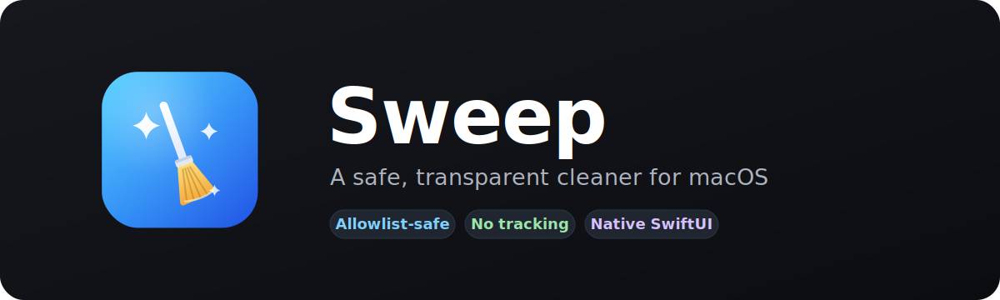
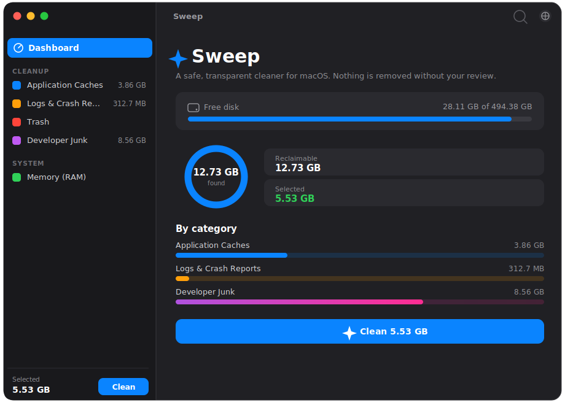

<div align="center">
  

  <p><a href="README.md">English</a> · <strong>Русский</strong></p>

  <p>
    
    
    
    
    
  </p>
</div>

**Sweep** — нативное приложение для macOS в духе CCleaner, построенное вокруг
одного принципа: **ничего не удаляется без вашего подтверждения — и только из
явно проверенного списка безопасных мест.** Освобождает место на диске от кэшей,
логов, корзины и мусора разработчика и показывает использование RAM в реальном
времени.

<div align="center">
  
</div>

## Зачем Sweep

Кэш и мусор быстро забивают macOS. Большинство «клинеров» непрозрачны, идут с
трекерами или удаляют слишком агрессивно. Sweep — противоположность:

- 🛡️ **Безопасность по allowlist.** Sweep трогает только небольшой, вручную
  проверенный набор корней. Каждый путь повторно валидируется прямо перед
  удалением. Симлинки, ведущие за пределы безопасных корней, отклоняются.
- 🗑️ **Обратимость по умолчанию.** Элементы уходят в Корзину, если вы явно не
  выбрали безвозвратное удаление. Перед очисткой — диалог подтверждения с
  отдельным предупреждением, если что-то удаляется навсегда.
- 🔍 **Прозрачность.** Вы видите каждый элемент, его размер и полный путь до того,
  как решите. Никаких скрытых действий.
- 🧾 **Честный отчёт.** Перемещение в Корзину никогда не выдаётся за «освобождено» —
  место освобождается только после очистки Корзины, и Sweep это проговаривает.
- 🌐 **Два языка.** Переключение между English, Русским и системным языком на лету.
- 🪶 **Лёгкость и приватность.** Нативный SwiftUI, ноль сторонних зависимостей,
  без телеметрии и без доступа к сети.

## Возможности

| Раздел | Что чистит |
|--------|------------|
| **Кэши приложений** | Кэши приложений в `~/Library/Caches` (приложения восстанавливают их сами) |
| **Логи и отчёты о сбоях** | `~/Library/Logs`, CrashReporter |
| **Корзина** | Очистка Корзины для немедленного возврата места |
| **Мусор разработчика** | Xcode DerivedData, iOS DeviceSupport, CoreSimulator, SwiftPM, npm, Gradle, Homebrew, CocoaPods, pip |
| **Память (RAM)** | Статистика давления на память + честная кнопка «освободить неактивную память» |

Плюс: обзор свободного места на диске, выбор «В корзину / Удалить» для каждого
пункта, «Выбрать всё / Снять выбор» и «Показать в Finder».

## Модель безопасности

Единственный чокпоинт — [`SafetyGuard`](Sources/Sweep/Engine/SafetyGuard.swift).
Любое удаление проходит через `validate()`:

1. **Allowlist** — путь обязан лежать внутри одного из явных корней
   (`~/Library/Caches`, `~/Library/Logs`, `~/Library/Developer`, `~/.Trash`,
   `~/.npm`, `~/.gradle/caches`, `~/.cache`, CrashReporter).
2. **Denylist** (защита в глубину) — Documents, Desktop, Downloads, iCloud Drive,
   Keychains, Mail, Messages и **Xcode Archives** всегда запрещены.
3. **Системные пути** (`/System`, `/usr`, `/Library`, …) всегда запрещены.
4. **Защита от symlink-побега** — путь резолвится, и реальная цель обязана
   остаться внутри разрешённого корня.
5. Корневую папку нельзя удалить целиком — только её содержимое.
6. **Повторная валидация прямо перед удалением** — состоянию галочек в UI движок
   не доверяет.

Всё это можно проверить безопасно, ничего не удаляя:

```bash
swift run Sweep --dryrun
```

Команда печатает, что *было бы* очищено, и прогоняет две самопроверки: проверку
безопасности (все опасные пути должны быть `BLOCKED`) и проверку локализации (все
строки интерфейса переведены на оба языка).

## Установка

### Вариант A — скачать сборку

Возьмите свежий `Sweep.app` со страницы
[**Releases**](https://github.com/Manser95/sweep/releases), перенесите в
`/Applications` и запустите.

> Приложение подписано ad-hoc (пока без нотаризации). При первом запуске:
> правый клик по приложению → **Открыть**, чтобы обойти Gatekeeper, либо
> выполните `xattr -dr com.apple.quarantine /Applications/Sweep.app`.

### Вариант B — сборка из исходников

**Требования:** macOS 14+, Xcode 16 / Swift 6 (достаточно command-line tools:
`xcode-select --install`).

```bash
git clone https://github.com/Manser95/sweep.git
cd sweep

# Запуск при разработке
swift run Sweep

# Или собрать распространяемый .app в dist/
./scripts/bundle.sh release
open dist/Sweep.app
```

### Full Disk Access

Чтобы Sweep чистил всё, выдайте ему полный доступ к диску:
**Системные настройки → Конфиденциальность и безопасность → Полный доступ к диску
→ добавить Sweep.app**. Без него Sweep тоже работает, но часть защищённых кэшей
будет пропущена.

## Про «память»

Sweep освобождает **место на диске** по-настоящему. **RAM нельзя «почистить»
удалением файлов** — ею управляет macOS. Вкладка «Память» показывает честную
статистику в реальном времени и предлагает `purge` неактивных/сжимаемых страниц;
эффект обычно недолгий. Никакой магии и обмана.

## Архитектура

```
Sources/Sweep/
  App/          — точка входа, активация GUI
  Models/       — типы данных (категории, правила, элементы, форматтер)
  Engine/       — SafetyGuard, каталог, сканер, удаление, RAM + диск
  Localization/ — Localizer (@Observable) + таблица строк ru/en
  ViewModels/   — SweepModel (@Observable, @MainActor)
  Views/        — Dashboard, Category, Memory, переиспользуемые компоненты
  main.swift    — entry + режим --dryrun
assets/         — icon.svg, AppIcon.icns, banner.svg, превью
scripts/        — bundle.sh, make-icon.sh, release.sh
```

Сделано на SwiftUI, Swift Observation и строгой конкурентности Swift 6. Без
сторонних зависимостей.

## Контрибьютинг

Вклад приветствуется — см. [CONTRIBUTING.md](CONTRIBUTING.md). Золотое правило:
**никогда не ослаблять `SafetyGuard`.** Новые цели очистки добавляются через
[`CleanupCatalog`](Sources/Sweep/Engine/CleanupCatalog.swift), а новые строки UI —
через таблицу локализации (оба языка).

## Планы

- Подпись и нотаризация для распространения
- Поиск дубликатов / крупных / старых файлов, остатков удалённых приложений
- Кэши браузеров по профилям (Chrome / Safari / Firefox)
- Очистка по расписанию
- Кнопка «Очистить Корзину сейчас» после перемещения в Корзину

## Лицензия

[MIT](LICENSE) © Sweep contributors
